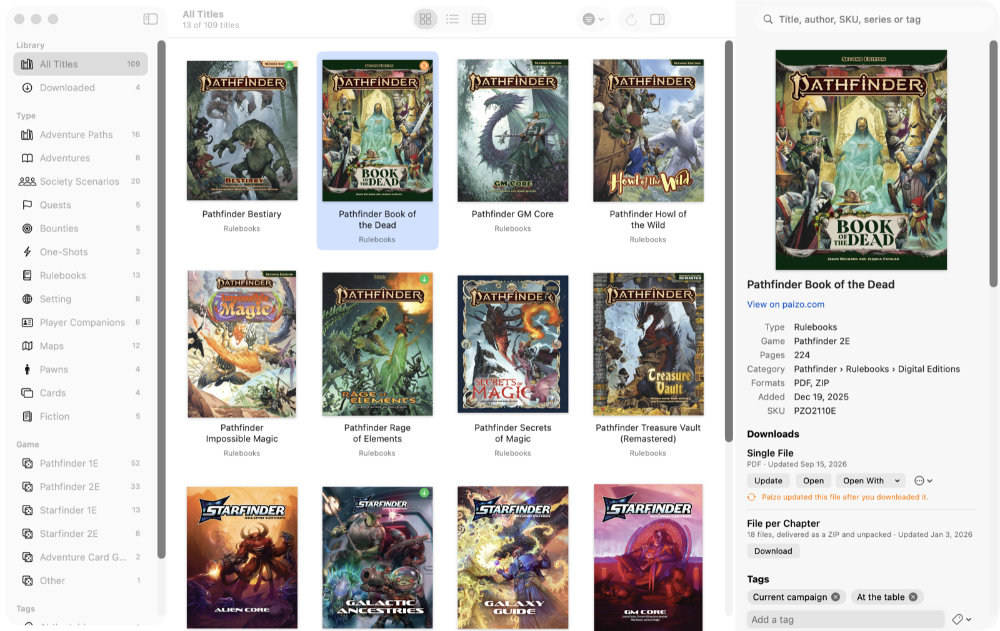

# Scrollkeeper

An unofficial library manager for your Paizo purchases. A native app for the Mac
and the iPad for browsing and downloading the digital library attached to your
[paizo.com](https://store.paizo.com) account.

Scrollkeeper downloads the list of everything you own once, keeps it on your
device, and gives you instant search, sorting, filtering, cover artwork,
summaries and tags.

It is free, and it only accesses files that your own account is entitled to
download.

> Scrollkeeper uses trademarks and/or copyrights owned by Paizo Inc.,
> used under Paizo's Community Use Policy
> ([paizo.com/licenses/communityuse](https://paizo.com/licenses/communityuse)).
> We are expressly prohibited from charging you to use or access this content.
> Scrollkeeper is not published, endorsed, or specifically approved by
> Paizo. For more information about Paizo Inc. and Paizo products, visit
> [paizo.com](https://paizo.com).



## Features

- Signs in with your Paizo account; credentials are kept in the macOS Keychain
  and the sign-in fields support Password AutoFill from the Passwords app.
- Downloads your full list of titles with a progress bar, and fetches cover
  artwork and summaries from the public storefront at the same time.
- Groups the different editions of a product (single file, file per chapter,
  lite versions) into one title. PDF editions that Paizo delivers as a zip are
  unpacked for you, so you get the chapters rather than an archive.
- Three ways to browse: cover thumbnails, a list, and a sortable column view.
- Search, plus filtering by game system, product type, level, format and tag.
- Automatic classification: adventure paths, stand-alone adventures, society
  scenarios (with season or year), maps, rulebooks, fiction and more.
- Tags that are written to the downloaded files as Finder tags.
- Downloaded files are kept on disk and can be opened straight from the app,
  with the default application or any other that handles the file type.

## Requirements

macOS 14 or later, or iPadOS 17 or later.

## Installing a release

Download the disk image from the
[releases page](https://github.com/scooper4711/scrollkeeper/releases), open it
and drag Scrollkeeper to Applications.

The app is not notarized by Apple, so the first time you open it macOS will
refuse. Right-click the app and choose Open, or allow it under System Settings ›
Privacy & Security. After that it opens normally.

## Supporting the project

The app is free and always will be. If it saves you time and you would like to
say thanks, you can leave a tip on [Ko-fi](https://ko-fi.com/coop207627). A
donation is entirely optional and unlocks nothing.

## Building

```sh
make app      # builds build/Scrollkeeper.app
make run      # builds and launches the app
make test     # runs the unit tests
make lint     # runs SwiftLint
make coverage # runs the tests and enforces the coverage threshold
make dmg      # packages the app into a disk image
```

Building needs Xcode 16 or later (Swift 6 toolchain). The app is ad-hoc signed;
after a rebuild, macOS may ask again for permission to use the saved Keychain
item.

## Building for iPad

The iPad app is built from `ios/Scrollkeeper.xcodeproj`, which uses the same
Swift package as the Mac app. It also needs Xcode's iOS platform component
(Xcode › Settings › Components).

1. Add your Apple ID to Xcode under Settings › Accounts. A free Apple ID works;
   an app signed that way runs for seven days before it has to be installed
   again, a paid developer account for a year.
2. Put your team in `ios/Local.xcconfig`, which is not committed (see
   `ios/Signing.xcconfig`). The team identifier is shown in Xcode when you
   select the Scrollkeeper-iPad target and open Signing & Capabilities.
3. Connect the iPad and turn on Developer Mode on it under Settings › Privacy &
   Security.
4. Run `make ipad-install`. It builds the app, installs it and starts it.
5. The first time, the iPad refuses to start the app until you trust the
   developer under Settings › General › VPN & Device Management.

When the seven days are up, `make ipad-install` again; the catalog and downloads
on the iPad are kept. You can also open `ios/Scrollkeeper.xcodeproj` in
Xcode and press Run. Open the project itself, not the package folder, and pick
the Scrollkeeper-iPad scheme.

`make ipad-simulator` builds the app and starts it in an iPad simulator.

On the iPad, downloads appear in the Files app under On My iPad. Opening a file
shows a preview; the share button offers every app that accepts the file. The
Files app's tags cannot be set by an app, so tags stay inside the app. The Mac
and the iPad each keep their own catalog, tags and downloads.

## Where things are stored

| What | Where |
|---|---|
| Catalog, summaries, tags | `~/Library/Application Support/Scrollkeeper/` (inside the app's container on the iPad) |
| Cover artwork | `~/Library/Application Support/Scrollkeeper/Covers/` |
| Downloaded files | Mac: `~/Library/Application Support/Scrollkeeper/Files/` (changeable in Settings). iPad: the app's Documents folder, shown in Files |
| Password | macOS Keychain, service `store.paizo.com` |

## Documentation

The requirements and design are in [`docs/specs/library-manager`](docs/specs/library-manager).

## Licences

Scrollkeeper includes [ZIPFoundation](https://github.com/weichsel/ZIPFoundation)
under the MIT licence; its notice is in
[THIRD-PARTY-NOTICES.md](THIRD-PARTY-NOTICES.md) and in the app's settings.
